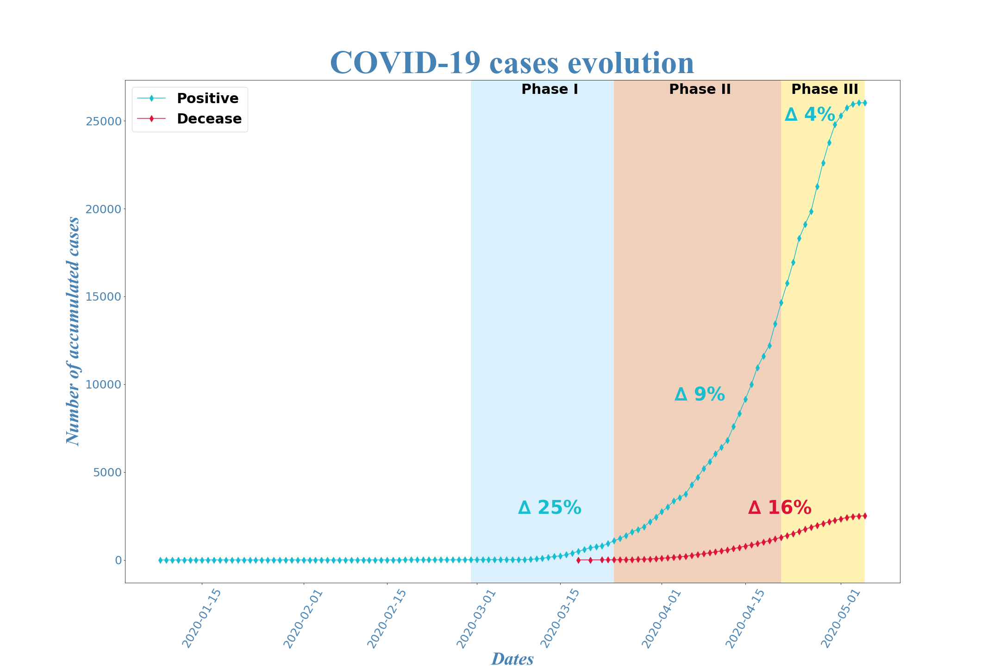
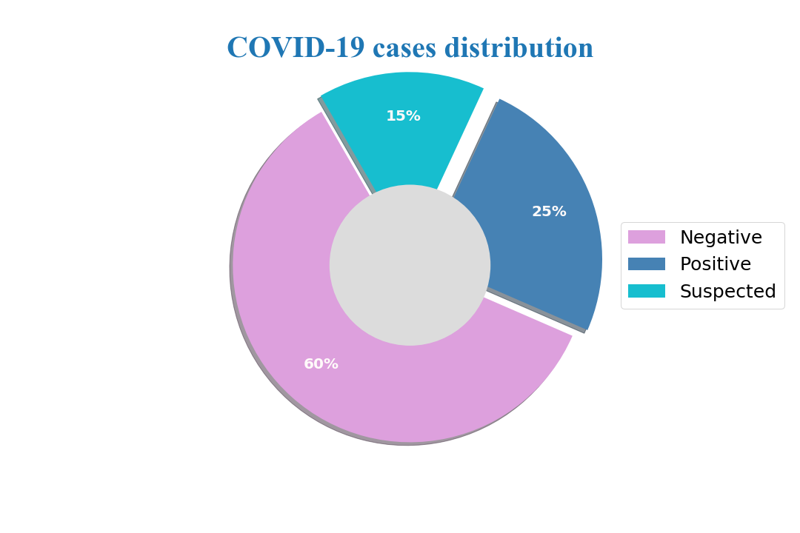
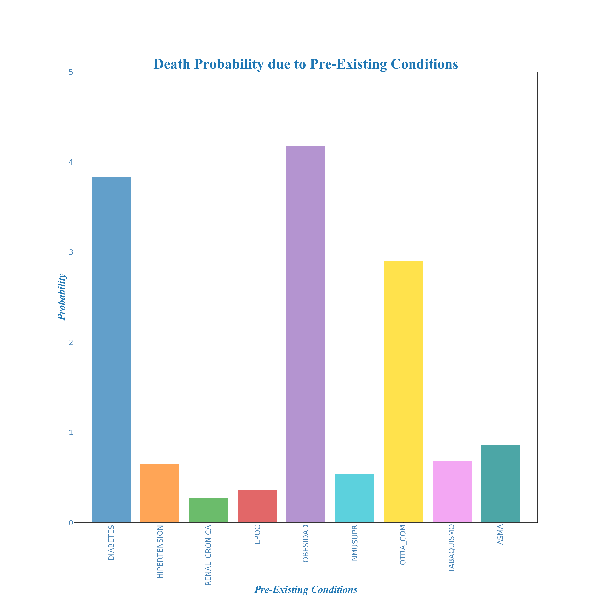

# Team project COVID19 MX
## Data science analysis of the virus evolution.
 
**Project Description:** This is our first teamwork project that consists on analyze COVID-19 cases in Mexico.

***Team:*** Bernardo Jardon, Miguel Bonachea, Odin Del Toro, Pablo Arroyo. 

**Objective:** Determine the current situation of cases with COVID-19 in Mexico through the analysis and visualization of the evolution of variables related to the disease in time.

**Topics and research questions:**

* Distribution and evolution of the disease 

* Age and Gender risk mortality

* Pre-existing diseases associated with COVID-19

* Correlation between death and diseases

* Death probability

* Cases by states, municipalities, hospitals and mortality

***Considerations:***
* Phase I Imported cases: Mexican Health Secretary announce on 29 of February 2020 four confirmed contagious cases imported from Italy as in the following link [COVID-19 Phase I](https://coronavirus.gob.mx/2020/02/29/conferencia-29-de-febrero/)
* Phase II Community dispersion: Mexican Health Secretary announce on 24 of March 2020 the start of the phase with local confirmed cases that hadn't travel to foreign countries as in the following link [COVID-19 Phase II](https://coronavirus.gob.mx/2020/03/24/inicia-fase-2-por-coronavirus-covid-19/)
* Phase III Epidemy: Mexican Health Secretary announce on 21 of April 2020 the start of the phase with local and regional confirmed cases as in the following link [COVID-19 Phase III](https://coronavirus.gob.mx/2020/04/21/inicia-la-fase-3-por-covid-19/)
* Growth rate = ((number of acummulated cases new day/number of acummulated cases previous day)^(1/(new date-previous date)))-1

***Notes:*** For description of variables used in topics research review the descriptors file.

***Dataset:*** The data is extracted from the Mexican Health Secretary in the following link
[COVID-19](https://www.gob.mx/salud/documentos/datos-abiertos-152127?idiom=es)

***Data premises:*** 
* Data is updated on a daily basis. 
* Acummulated data as of 05/05/2020.
 
 Summary statistics and visualizations created using Python, Pandas, Matplotlib and gmaps. 
 
 
 
 
 
 
 
 
 
 
 
 
 
 
 
